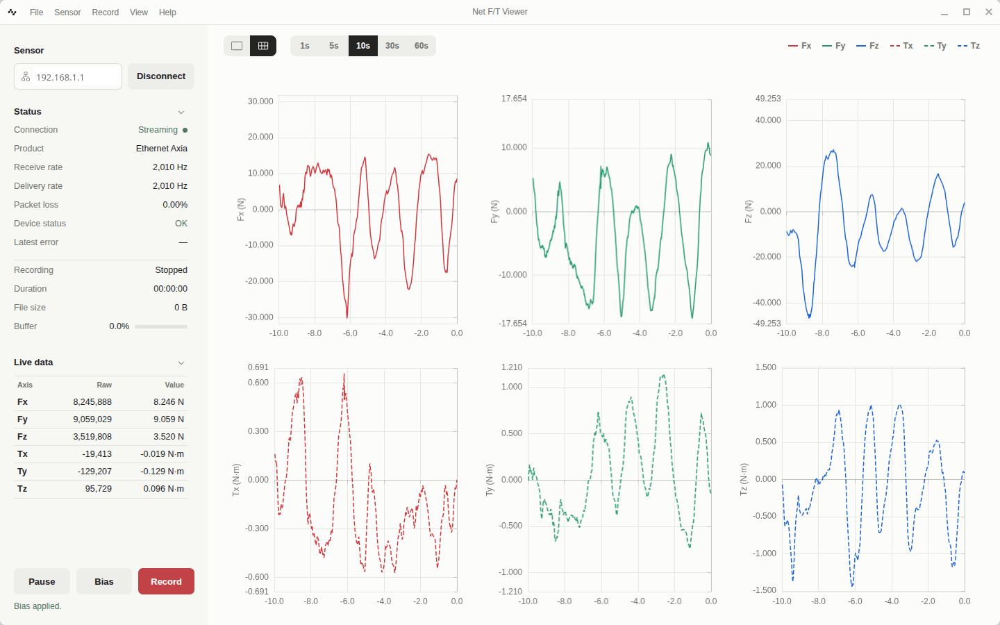
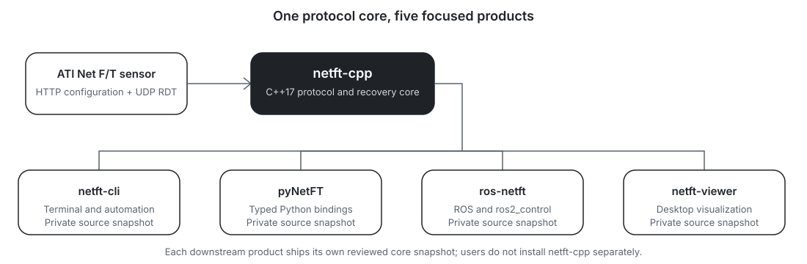

# Net F/T

**Open-source software for ATI Net F/T Ethernet force/torque sensors.**

Build native or Python applications, automate sensor workflows from a
terminal, integrate force/torque data into ROS and `ros2_control`, or inspect
and record measurements from a desktop viewer.

[Documentation](https://netft.dev) ·
[Desktop viewer](https://github.com/netft/netft-viewer/releases) ·
[CLI](https://github.com/netft/netft-cli) ·
[Python package](https://pypi.org/project/pynetft/) ·
[ROS driver](https://github.com/netft/ros-netft) ·
[C++ SDK](https://github.com/netft/netft-cpp)

  

## Choose a project

| I want to… | Project | What it provides |
| --- | --- | --- |
| Build a native application | [**netft-cpp**](https://github.com/netft/netft-cpp) | Cross-platform C++17 SDK and CMake package |
| Work in a terminal or script | [**netft-cli**](https://github.com/netft/netft-cli) | Diagnostics, monitoring, structured output, bias, and recording |
| Build a Python application | [**pyNetFT**](https://github.com/netft/pyNetFT) | Typed synchronous Python API backed by a native C++ core |
| Integrate a robot or controller | [**ros-netft**](https://github.com/netft/ros-netft) | ROS 1 and ROS 2 driver with `ros2_control` sensor integration |
| Inspect and record live data | [**netft-viewer**](https://github.com/netft/netft-viewer) | Cross-platform desktop plots, health monitoring, and CSV capture |

Component repositories own source, releases, version-specific notes, and
contribution instructions. Shared user guides and references live at
[netft.dev](https://netft.dev).

## How the projects fit together

The projects share the same protocol, calibration, unit, sequence-health, and
recovery semantics. Downstream applications carry reviewed source snapshots
of `netft-cpp`, so their release artifacts remain self-contained and do not
require a separately installed SDK.

## Start here

Use the [installation guide](https://netft.dev/docs/get-started/installation)
to choose a component and platform, then follow the
[quick start](https://netft.dev/docs/get-started/quick-start) to connect to a
sensor. The documentation also provides complete
[tutorials](https://netft.dev/docs/tutorials/fundamentals/sensor-measurements)
and [references](https://netft.dev/docs/references/about).

## Platform support

`netft-cpp`, `netft-cli`, pyNetFT, and Net F/T Viewer support Linux, Windows,
and macOS through their documented source builds or release artifacts.
`ros-netft` supports the ROS distributions listed in its compatibility table.
Follow each repository's support table for exact operating-system,
architecture, language, and middleware combinations.

## Support and contributions

Report bugs, request features, or ask project-specific questions in the issue
tracker of the relevant repository. Contributions are welcome through pull
requests; review that project's contribution guide before submitting one.

---

  Community-maintained projects, not affiliated with ATI Industrial Automation.

